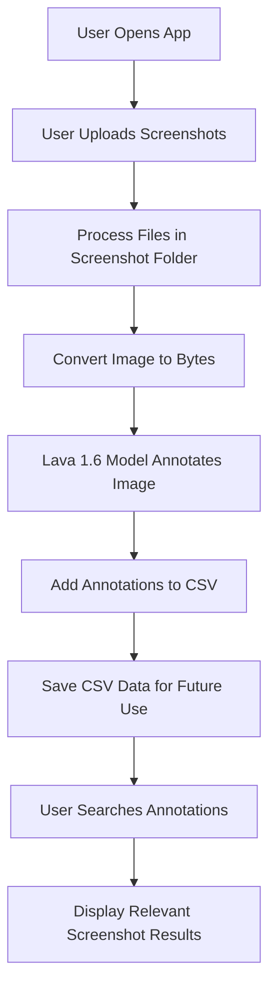

# Project 1: 🖥️ Ai Workflow App - Screenshot Annotation and Search

---

## 🚀 Overview

In this project, we build a simple app that processes screenshots from a local folder, annotates them using an AI model, and organizes the data for easy search and retrieval. This method helps manage and search through large collections of screenshots.

---

## 🛠️ **App Components and Workflow**

### 1. **🔝 Navigation Bar**
- **Vibrant App Title**
- **User Profile Icon**
- **Quick Settings Button**

### 2. **📦 Workspace Area**
- **Expansive Upload Zone**
- **Clean, Intuitive Design**
- **Drag-and-Drop Functionality**

### 3. **📸 Screenshot Upload**
- **Multiple Image Format Support**
- **Instant Preview**
- **Easy File Selection**

### 4. **🤖 AI Analysis Panel**
- **Real-Time Processing Indicators**
- **Intelligent Text Extraction**
- **Instant Indexing Notifications**

### 5. **🔍 Smart Search Interface**
- **Natural Language Queries**
- **Advanced Filtering**
- **Intelligent Autocomplete**

### 6. **📊 Results Display**
- **Dynamic Screenshot Grid**
- **Detailed Preview**
- **Text Overlay**
- **Relevance Scoring**

### 7. **🛠️ User Controls**
- **Smart Tagging**
- **Collection Management**
- **Easy Sharing Options**

---

## 🔄 **Key Workflows**

1. **Upload Screenshots**
   - Import screenshots to the app.
  
2. **AI Text Extraction**
   - Use the Lava 1.6 AI model to automatically annotate images with descriptive captions.
  
3. **Content Indexing**
   - Store annotations in a CSV file or database for later use.

4. **Natural Language Search**
   - Search using natural language queries to retrieve relevant images.

5. **Screenshot Analysis**
   - View annotated images and get detailed descriptions.

---

## 🚀 **Performance Highlights**

- **Responsive Design**: Works on all devices with an intuitive layout.
- **Lightning-Fast Processing**: Efficient AI model for quick text extraction.
- **Seamless Background Operations**: Process images in the background while you work.
- **Offline Capabilities**: Operates fully offline for privacy and efficiency.

---

## 📋 **Project Overview**

### **AI Screenshot Annotation**

This project is based on the idea of improving screenshot management. Over time, your screenshots folder can get overwhelming, and finding specific images becomes a challenge. By using the **Lava 1.6** AI model, we can automatically annotate each screenshot with a description, making it easier to search for and organize your images.

#### **Main Components**:
- **Screenshots Folder**: A folder containing images (e.g., PNG, JPEG) that need to be processed.
- **AI Model**: Lava 1.6 model is used to annotate the images. It's best to use models with higher parameter counts (13B, 34B) for better accuracy.
- **CSV File**: All annotated data is stored in a CSV for future reference or use in a database.
  
---

## 🧑‍💻 **Technical Process**

### **Folder Management**
- We first scan the folder where screenshots are saved. Over time, this folder can become quite large, and manually browsing through it is inefficient.
- We retrieve the list of files and sort them for processing.

### **AI Image Annotation**
- Images are loaded, converted to byte format, and passed to Lava 1.6 for annotation.
- A custom **prompt** is used to guide the AI in describing the image, with specific focus on text within the image for better search results.

### **Model Selection**
- The **7B, 13B, and 34B** models are available, with the 13B model providing a good balance between speed and accuracy. The 34B model is the most accurate but requires more system resources.
  
### **CSV File Handling**
- If a **CSV file** exists, it’s loaded and checked for already processed images.
- If an image hasn’t been processed, it is annotated and added to the CSV with the corresponding description.

---

## **App Workflow Diagram**

